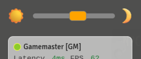
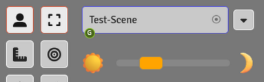

# Arga's Day-Night Slider  (Foundry VTT, Version 13)

This is a system-agnostic, very lightweight GM module for quick and easy adjustment of canvas brightness.

The widget can be freely repositioned by simply dragging it, and it remembers its last position on restart.

The widget can also be docked to the Active Players window or the Scene Navigation bar, so it moves along when these panels expand. 

  
  &nbsp;&nbsp;<em>or</em>&nbsp;&nbsp;
  

Otherwise, when being repositioned, it will try to snap to the hotbar, the sidebars, or the edge of the canvas.

When the UI scaling or fading settings are changed, the widget automatically adapts.

## Adjusting Brightness

There are several ways to adjust the canvas brightness via the widget:

1. Click the **sun** or **moon** icon to instantly set maximum brightness or darkness.
2. Grab the slider handle with the **left mouse button** and drag it.
3. Hover the cursor over the slider (without clicking) and use the **scroll wheel**:
   - **Scroll Wheel** — Steps of 1/100 (i.e. 1% increments for smooth adjustments)
   - **Ctrl + Scroll** — Steps of 1/300 (for subtle, creeping changes your players will barely notice)
   - **Shift + Scroll** — Steps of 1/12 (i.e. 12 scroll steps = 12 hours)

## Repositioning the Widget

There are also several ways to move the widget around:

1. **Easiest method:** Grab it with the **right mouse button** and drag it to the desired position. The two fixed docking points are the Active Players window (bottom-left) and the Scene Navigation bar (top-left). When the widget approaches these areas, it will wiggle to indicate the correct docking position. Release it there and it will snap into place.
2. **Alternative method:** Move the cursor toward the widget to reveal a drag handle (three dots) above it. Hold it with the left mouse button to drag the widget around. This option was added as it may feel more intuitive to some users than right-click dragging.
3. **Quick reset:** Regardless of the widget's current position, double-clicking the drag handle will return it to one of the two docking positions — whichever it was last docked to.

## Notes

Bug reports and incompatibility reports with other modules are welcome, but please don't request additional features. This module is intentionally kept small and simple, and that's by design. For extended functionality like time of day, calendars, or moon phases, there are already wonderful other modules available.

---

*Enjoy — Arga*
